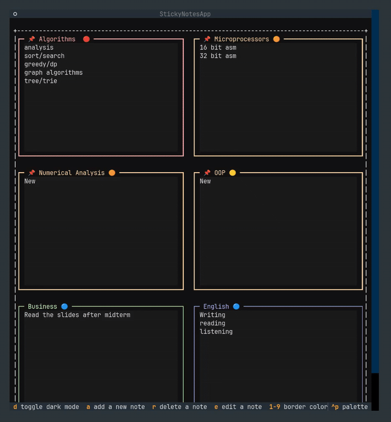

# Sticky Notes TUI


**Sticky Notes TUI** is a modern, keyboard-centric terminal-based application designed to manage your thoughts, tasks, and reminders efficiently. Built with Textual, it offers a seamless graphical experience directly within your console, featuring rich colors, priority management, and persistent storage.

---

## Table of Contents

- [Features](#features)
- [Installation](#installation)
- [Usage & Keybindings](#usage--keybindings)
- [Priority & Organization](#priority--organization)
- [Configuration & Storage](#configuration--storage)
- [Project Structure](#project-structure)
- [License](LICENSE)

---

## Features

* **Keyboard-First Navigation:** Navigate, create, edit, and delete notes without ever leaving your keyboard.
* **Rich Color Coding:** Organize notes visually using 9 distinct colors with simple hotkeys.
* **Priority Management:** Assign 5 levels of priority (from Trivial to Critical) with visual indicators.
* **Pinning System:** Pin important notes to keep them highlighted and distinguished.
* **Advanced Search:** Filter notes instantly by title, content, or tags via a dedicated modal.
* **Persistent Storage:** Automatically saves your notes to your OS-specific application data directory (supports Linux, macOS, and Windows).
* **Dark/Light Mode:** Toggle between themes to suit your environment.
* **Responsive Layout:** Grid layout automatically adjusts columns based on your terminal width.

---
# GIF


## Installation

### Prerequisites

- Python 3.8 or higher
- **uv** (fast Python package manager)
- A terminal emulator with TrueColor support (most modern terminals support this).


### Steps

1.  **Clone the Repository**
    ```bash
    git clone https://github.com/m4cd4r4/textual-sticky-notes-tui.git
    cd textual-sticky-notes-tui
    ```

2.  **Create and Sync the Environment**
    ```bash
    uv sync
    ```
    This command:

    -Creates a virtual environment
        
    -Installs dependencies from pyproject.toml
        
    -Uses the lockfile for reproducible installs


3.  **Run the Application**
    ```bash
    uv run python src/main.py
    ```

# Notes
    No manual venv activation required

    No direct pip install needed

    Fast, reproducible, and modern Python workflow

---
## Global Installation (Linux)

For Linux users, the project includes a helper script (`manage.sh`) that installs the application system-wide to `/usr/local/bin`. This allows you to launch the application from any terminal window by simply typing its name.

### Installation

1.  **Make the script executable:**
    ```bash
    chmod +x manage.sh
    ```

2.  **Install globally:**
    Since this installs to a system directory, root privileges are required.
    ```bash
    sudo ./manage.sh install
    ```

3.  **Run the application:**
    Once installed, you can start the app from anywhere (no sudo required):
    ```bash
    stickynotes
    ```

### Uninstallation

To remove the application command from your system:

```bash
sudo ./manage.sh uninstall
```

## Usage & Keybindings

Once the application is running, you can use the following keys to interact with the interface.

### Global Controls

| Key | Action | Description |
| :--- | :--- | :--- |
| **`a`** | **Add Note** | Create a new sticky note. |
| **`e`** | **Edit Note** | Edit the content, title, priority, or pin status of the focused note. |
| **`r`** | **Remove Note** | Delete the currently focused note (triggers a confirmation modal). |
| **`s`** | **Search** | Open the search modal to find specific notes. |
| **`o`** | **Sort** | Sort notes automatically (Pinned first, then by Priority). |
| **`d`** | **Toggle Theme** | Switch between Dark and Light mode. |
| **`Ctrl+s`** | **Save** | Manually force save to disk. |
| **`Ctrl+c`** | **Quit** | Force quit the application. |
 
### Navigation

| Key | Action |
| :--- | :--- |
| **`Arrow Keys`**or**`h-j-k-l`** | Move focus between notes. |
| **`Tab`** | Move focus between parts inside a modal. |

### Styling (When a note is focused)

| Key | Action |
| :--- | :--- |
| **`1` - `9`** | Change the border color of the selected note. |

---

## Priority & Organization

Sticky Notes TUI allows you to categorize the urgency of your tasks. When editing a note (`e`), you can select one of the following levels:

1.  **Trivial** (Default)
2.  **Low**
3.  **Medium**
4.  **High**
5.  **Critical**

### Icons & Visuals
Notes display visual icons corresponding to their priority level and pin status.
* **Pinned Notes:** Display a heavier border and a pin icon in the title.
* **Priority Icons:** Higher priorities display distinct glyphs in the header.

---

## Configuration & Storage

The application uses an intelligent storage system that respects your operating system's standards. You do not need to configure anything; it just works.

**Data Location:**
* **Linux:** `~/.local/share/sticky-notes/notes.json` (XDG Base Directory)
* **macOS:** `~/Library/Application Support/StickyNotes/notes.json`
* **Windows:** `%APPDATA%\StickyNotes\notes.json`

The data is saved in a human-readable JSON format, allowing for easy backup or manual inspection if necessary.

---

## CLI Tool

A command-line interface for adding notes programmatically (useful for automation and scripts):

```bash
# Add a note
python src/cli.py add -t "Title" -c "Content" --tags "tag1,tag2" --color green

# Add a session summary note
python src/cli.py add -t "Session Summary" -c "Tasks done..." --session-note --project "MyProject"

# List recent notes
python src/cli.py list --limit 5

# Search notes
python src/cli.py search "keyword"
```

### Available Options

| Option | Description |
|--------|-------------|
| `-t, --title` | Note title (required) |
| `-c, --content` | Note content (required) |
| `--tags` | Comma-separated tags |
| `--color` | Note color (yellow, blue, green, pink, white, red, orange, purple, cyan) |
| `--priority` | Priority level (0-4) |
| `--pinned` | Pin the note |
| `--session-note` | Mark as session summary with metadata |
| `--project` | Project name (used with --session-note) |

---

## Project Structure

```text
src/
├── app.py                  # Main application logic (StickyNotesApp)
├── cli.py                  # Command-line interface for automation
├── main.py                 # Entry point
├── models.py               # Data models (Note class)
├── storage.py              # JSON storage handler (Cross-platform)
├── style.css               # Textual CSS styling
└── components/             # UI Components
    ├── stickyNote.py       # Individual Note widget
    ├── editModal.py        # Edit/Create popup
    ├── searchModal.py      # Search functionality
    └── deleteModal.py      # Confirmation popup
```

---

## Related Projects

- [Sticky Notes Electron](https://github.com/m4cd4r4/stickynotes-electron) - Modern desktop GUI with glassmorphism design (syncs with TUI)

## License

MIT


